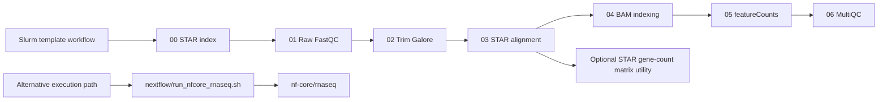

# RNA-seq Workflow for Slurm

## Overview

This repository contains a lightweight bulk RNA-seq workflow for Slurm environments based on the local scripts in `mycodes/bulk` and `mycodes/bulkEric`. The staged workflow covers raw FASTQ quality control, adapter trimming, STAR genome indexing and alignment, BAM indexing, feature counting, and MultiQC reporting. A separate wrapper for `nf-core/rnaseq` is also included.

## Execution Modes

Two execution modes are provided:

- a template-based Slurm workflow via `bin/rnaseq-init` and `bin/rnaseq-submit`
- wrapper scripts for `nf-core/rnaseq` in `nextflow/`

## Workflow Summary

Core processing steps:

0. `00_star_index.sh`
1. `01_fastqc_raw.sh`
2. `02_trim_galore.sh`
3. `03_star_align.sh`
4. `04_samtools_index.sh`
5. `05_featurecounts.sh`
6. `06_multiqc.sh`

Optional companion utility:

- `scripts/star_gene_counts_to_matrix.R` converts STAR `ReadsPerGene.out.tab` files into a tabular count matrix using the same logic as the original downstream notebook helper.



## Installation and Requirements

The Slurm workflow requires:

- Bash
- Perl
- a Slurm environment for job submission
- project-specific reference assets and configuration files

End-to-end execution also requires the relevant analysis tools for the chosen path, including `fastqc`, `trim_galore`, `STAR`, `samtools`, `featureCounts`, and `multiqc`. The wrapper-based alternative additionally requires `nextflow`.

## Usage

Minimal Slurm workflow:

```bash
bin/rnaseq-init \
  --project-dir /path/to/project \
  --sample-file examples/slurm-dry-run/samples.txt \
  --experiment demo_run
```

Dry-run the submission chain:

```bash
bin/rnaseq-submit --experiment-dir demo_run --dry-run
```

For the wrapper-based alternative:

```bash
bash nextflow/run_nfcore_rnaseq.sh config/nextflow.env
```

Additional usage notes are provided in:

- `docs/quickstart.md`
- `docs/inputs.md`
- `docs/outputs.md`
- `docs/reproducibility.md`

## Inputs, Outputs, and Reproducibility

Project-specific reference assets, FASTQ naming, and tool paths are supplied through configuration files. Input requirements, output locations, and reproducibility notes are documented in:

- `docs/inputs.md`
- `docs/outputs.md`
- `docs/reproducibility.md`

## Local Validation

Smoke-test assets are provided in `tests/smoke/`. On May 19, 2026, the local smoke test syntax-checked the entrypoints, Slurm templates, Nextflow wrappers, Perl helpers, and the optional R utility, then rendered a demo experiment bundle and dry-ran the full `00` to `06` submission chain. This validates repository structure and submission ordering, but not end-to-end biological execution. The local Mac had `samtools`, `Rscript`, and `perl` available, but did not have `fastqc`, `trim_galore`, `STAR`, `featureCounts`, `multiqc`, or `nextflow` installed at validation time. Full validation notes are tracked in `docs/development/validation.md`.

## Repository Layout

- `bin/`: user-facing command entrypoints
- `templates/slurm/`: core Slurm workflow templates
- `scripts/`: implementation scripts used by the `bin/` wrappers
- `config/`: example configuration files
- `nextflow/`: `nf-core/rnaseq` wrappers
- `examples/`: minimal example inputs
- `tests/smoke/`: local smoke-test assets
- `docs/`: workflow documentation

## References

- [nf-core/rnaseq](https://github.com/nf-core/rnaseq)
