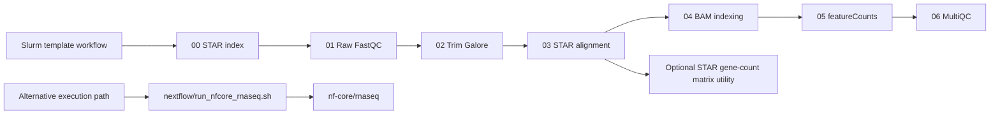

# RNA-seq Workflow for Slurm

## Overview

This repository contains a lightweight bulk RNA-seq workflow for Slurm environments based on the local scripts in `mycodes/bulk` and `mycodes/bulkEric`. The staged workflow covers raw FASTQ quality control, adapter trimming, STAR genome indexing and alignment, BAM indexing, feature counting, and MultiQC reporting. A separate wrapper for `nf-core/rnaseq` is also included.

This is a custom portfolio workflow, not an official nf-core pipeline and not a claim of nf-core standards compliance. The nf-core wrapper delegates analysis to `nf-core/rnaseq`; the numbered Slurm templates are an independent execution path.

## Scientific Purpose

The workflow makes the operational steps of a bulk RNA-seq analysis explicit and reviewable: inputs, scheduler dependencies, reference assets, tool versions, and expected output locations. The included dry-run example validates orchestration only. It does not reproduce a historical cohort, execute alignment or counting, or establish biological findings.

## Contribution and Provenance

The step order and scientific operations were adapted from the author's applied `mycodes/bulk` scripts, with `bulkEric` used as a Slurm reference. The author confirmed ownership of these workflow scripts on October 1, 2026. Parameterization, portable entrypoints, dry-run testing, synthetic examples, and documentation were produced during assisted portfolio curation. Institutional release permission, final contribution wording, and a license choice remain required before publication; see `docs/review/PRIVATE_REVIEW.md`.

## Execution Modes

Two execution modes are provided:

- a template-based Slurm workflow via `bin/rnaseq-init` and `bin/rnaseq-submit`
- wrapper scripts for `nf-core/rnaseq` in `nextflow/`

## Workflow Summary

Core processing steps:

0. `00_star_index.sh`
1. `01_fastqc_raw.sh`
2. `02_trim_galore.sh`
3. `03_star_align.sh`
4. `04_samtools_index.sh`
5. `05_featurecounts.sh`
6. `06_multiqc.sh`

Optional companion utility:

- `scripts/star_gene_counts_to_matrix.R` converts STAR `ReadsPerGene.out.tab` files into a tabular count matrix using the same logic as the original downstream notebook helper.



## Methodology and Expected Outputs

| Stage | Purpose | Representative output |
| --- | --- | --- |
| `00_star_index.sh` | Build a STAR reference index | configured genome-index directory |
| `01_fastqc_raw.sh` | Inspect raw-read quality | FastQC reports |
| `02_trim_galore.sh` | Trim adapters and low-quality sequence | trimmed FASTQ files |
| `03_star_align.sh` | Align reads and emit STAR gene-count tables | BAM and `ReadsPerGene.out.tab` files |
| `04_samtools_index.sh` | Index aligned BAM files | `.bai` indexes |
| `05_featurecounts.sh` | Produce annotation-based gene counts | featureCounts tables |
| `06_multiqc.sh` | Aggregate run-level quality reports | MultiQC report |

The optional R utility converts STAR count tables into a sample-by-gene matrix. It does not normalize counts, perform differential expression, or infer biological conclusions.

## Installation and Requirements

The Slurm workflow requires:

- Bash
- Perl
- a Slurm environment for job submission
- project-specific reference assets and configuration files

End-to-end execution also requires the relevant analysis tools for the chosen path, including `fastqc`, `trim_galore`, `STAR`, `samtools`, `featureCounts`, and `multiqc`. The wrapper-based alternative additionally requires `nextflow`.

`environment/slurm-tools.yml` records the exact historical command-line versions represented by the templates. It is a review candidate until it is solved and exercised on the target Linux/Slurm platform.

## Quick Start: Synthetic Dry Run

The included sample identifiers are invented. Generate a workflow bundle without submitting jobs:

```bash
bin/rnaseq-init \
  --project-dir /path/to/project \
  --sample-file examples/slurm-dry-run/samples.txt \
  --experiment demo_run
```

Dry-run the submission chain:

```bash
bin/rnaseq-submit --experiment-dir demo_run --dry-run
```

The expected normalized submission plan is committed at `examples/slurm-dry-run/expected_submission_plan.txt`. Sample identifiers are synthetic and have no relationship to patient or institutional data.

To run the repository smoke test locally:

```bash
bash tests/smoke/run_slurm_smoke.sh
```

The smoke test checks shell/Perl syntax, sample-manifest preservation, generated-script structure, and exact dependency ordering. It does not run Slurm, alignment, counting, or real data.

For the wrapper-based alternative:

```bash
bash nextflow/run_nfcore_rnaseq.sh config/nextflow.env
```

Additional usage notes are provided in:

- `docs/quickstart.md`
- `docs/inputs.md`
- `docs/outputs.md`
- `docs/reproducibility.md`

## Inputs, Outputs, and Reproducibility

Project-specific reference assets, FASTQ naming, and tool paths are supplied through configuration files. Input requirements, output locations, and reproducibility notes are documented in:

- `docs/inputs.md`
- `docs/outputs.md`
- `docs/reproducibility.md`

## Local Validation

The May 19, 2026 record below is retained as historical repository documentation. On October 1, 2026, the optional R parser and a synthetic STAR count-matrix fixture passed under the normal installed R 4.6.1 framework. The earlier manually extracted runtime was not used for those results. macOS command-line signature checks for R.app remain unresolved, and the repository's draft GitHub workflow has not yet run; see `docs/review/PRIVATE_REVIEW.md`.

Smoke-test assets are provided in `tests/smoke/`. On May 19, 2026, the local smoke test syntax-checked the entrypoints, Slurm templates, Nextflow wrappers, Perl helpers, and the optional R utility, then rendered a demo experiment bundle and dry-ran the full `00` to `06` submission chain. This validates repository structure and submission ordering, but not end-to-end biological execution. The local Mac had `samtools`, `Rscript`, and `perl` available, but did not have `fastqc`, `trim_galore`, `STAR`, `featureCounts`, `multiqc`, or `nextflow` installed at validation time. Full validation notes are tracked in `docs/development/validation.md`.

| Validation layer | Current status |
| --- | --- |
| Bash and Perl syntax | Passed locally |
| Synthetic dependency dry run | Passed locally with exact expected-plan comparison |
| STAR count-table utility | Parsed and passed a two-sample synthetic fixture with edgeR 4.10.5 |
| GitHub Actions workflow | Draft present; not yet run |
| Conda environment | Candidate only; not solved |
| Slurm and external RNA-seq tools | Not executed |
| Real-data or biological validation | Not performed |

## Repository Layout

- `bin/`: user-facing command entrypoints
- `templates/slurm/`: core Slurm workflow templates
- `scripts/`: implementation scripts used by the `bin/` wrappers
- `config/`: example configuration files
- `nextflow/`: `nf-core/rnaseq` wrappers
- `examples/`: minimal example inputs
- `tests/smoke/`: local smoke-test assets
- `environment/`: candidate pinned toolchain for review
- `docs/`: workflow documentation

## References

- [nf-core/rnaseq](https://github.com/nf-core/rnaseq)
- [STAR](https://github.com/alexdobin/STAR)
- [SAMtools](https://www.htslib.org/)
- [featureCounts](https://subread.sourceforge.net/)
- [MultiQC](https://multiqc.info/)

## Attribution, Citation, and License Status

- This repository has no DOI. Until a release exists, cite the repository URL and exact commit SHA, together with the tools used for the executed path.
- The nf-core wrapper should be reported as an invocation of `nf-core/rnaseq`; this repository does not rebrand itself as an nf-core pipeline.
- Record the sample sheet, configuration files, reference manifest, software versions, scheduler environment, and commit SHA for every run.
- The user confirmed authorship of the workflow scripts. No repository license has been selected, so no public reuse permission is granted by this repository yet. Institutional release permission and a license choice are required before publication.
- Contributions should remain on review branches until CI, target-platform validation, provenance wording, and rights review are complete.
